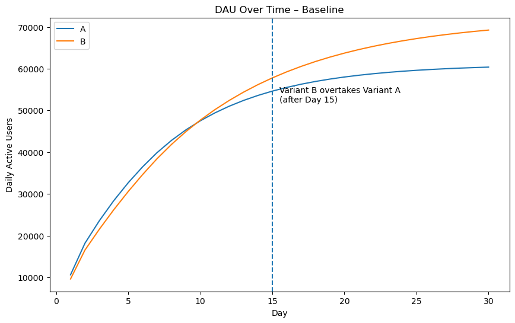
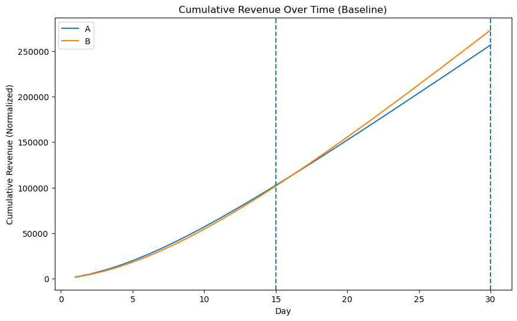
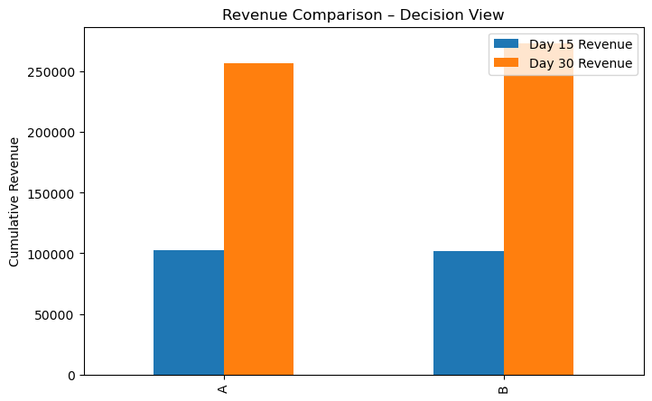
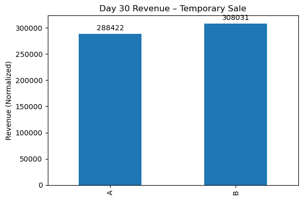
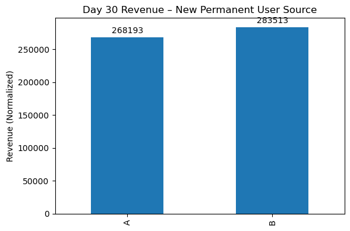

# Vertigo Games – Data Analyst Case Study

## Objective
Evaluate two difficulty-flow variants using cohort-based modeling to determine:
- DAU evolution
- Revenue performance
- Impact of temporary vs permanent improvements

---

## Methodology
- Daily cohort simulation (20,000 installs/day)
- Log-linear retention interpolation
- Constant ARPPU across variants 
- Revenue = IAP + Ads
- Fully deterministic (no randomness)

---

## DAU Evolution

Variant A shows stronger early retention, but Variant B overtakes after Day 15 due to significantly stronger late-game retention.

---

## Cumulative Revenue (Baseline)

While Variant A performs slightly better in the short term, Variant B consistently generates higher cumulative revenue as the time horizon extends.

---

## Executive Revenue Comparison

- **Day 15:** Variant A slightly ahead  
- **Day 30:** Variant B clearly ahead  

This confirms that Variant B is the superior long-term choice.

---

## Scenario 1 – Temporary Sale (Day 15–25)

A temporary purchase-rate boost benefits both variants, but Variant B gains more due to its larger active user base.

---

## Scenario 2 – New Permanent User Source

Introducing a permanent user source amplifies Variant B’s advantage due to its slower retention decay.

---

## Final Recommendation

**Winner Variant: B**

If only one improvement can be prioritized:
- ❌ Temporary sale  
- ✅ Permanent new user source  

Long-term retention and monetization efficiency outweigh short-term revenue uplifts.

*  I took ARPPU as $5 since mobile FPS games(PUBG, Fortnite, Free Fire) are microtransaction heavy games but I may underestimate it for Critical Strike case since it is still scaling and may have a bigger ARPPU

** Results are affected by ARPPU assumption, for lower ARPPU assumptions ads revenue may become more important and variantB may not beat variantA in day30 cumulative revenue

---

## Release
Final version tagged as **v1.0**

