# Vertigo Games – Data Analyst Case Study

## Task 1 – Objective
Evaluate two difficulty-flow variants using cohort-based modeling to determine:
- DAU evolution
- Revenue performance
- Impact of temporary vs permanent improvements

---

## Task 1 – Methodology
- Daily cohort simulation (20,000 installs/day)
- Log-linear retention interpolation
- Constant ARPPU across variants 
- Revenue = IAP + Ads
- Fully deterministic (no randomness)

---

## DAU Evolution

Variant A shows stronger early retention, but Variant B overtakes after Day 15 due to significantly stronger mid-game and late-game retentions.

---

## Cumulative Revenue

While Variant B performs slightly better in the short term, however it consistently generates higher cumulative revenue as the time horizon extends.

---

## Revenue Comparison

- **Day 15:** Variant B slightly ahead  
- **Day 30:** Variant B clearly ahead  

This confirms that Variant B is the superior long-term choice.

---

## Scenario 1 – Temporary Sale Uplift (Day 15–25)

A temporary purchase-rate boost benefits both variants, but Variant B gains more due to its larger active user base.

---

## Scenario 2 – New Permanent User Source

Introducing a permanent user source amplifies Variant B’s advantage due to its slower retention decay.

---

## Task 1 – Final Recommendation

**Winner Variant: B**

If only one improvement can be prioritized:
- ❌ Temporary sale  
- ✅ Permanent new user source  

Long-term retention and monetization efficiency outweigh short-term revenue uplifts.

*  I took ARPPU as $11 because of shared dataset in Task2

** Results are affected by ARPPU assumption, for lower ARPPU assumptions ads revenue may become more important and variantB may not beat variantA in day30 cumulative revenue

---

# Task 2 – Exploratory Data Analysis (EDA)

## Overview

This notebook focuses on exploratory data analysis of player behavior and monetization patterns using daily aggregated user-level data.  
The goal is to uncover **engagement segments**, **lifecycle trends**, and **retention–monetization dynamics** that can inform product and business decisions.

The dataset contains ~7.3M daily records across multiple CSV files, each representing aggregated in-game and monetization activity per user per day.

---

## Dataset Summary

Each row represents **one aggregated daily record per user**, validated explicitly in the analysis.

Key fields include:
- User lifecycle: `install_date`, `event_date`, `user_age`
- Engagement: session counts, session duration, match starts/ends
- Performance: victories, defeats
- Monetization: IAP revenue, ad revenue
- Dimensions: platform, country

Observation window is finite and explicitly respected in all cohort definitions to avoid right-censoring bias.

---

## Methodology Highlights

### Observation Window & Bias Control
- All lifecycle metrics (LTV, retention) are computed only for users whose **install dates allow full observation windows**.
- Long-tail noise is controlled by:
  - Limiting lifecycle visualizations to `user_age ≤ 360`
  - Restricting country-level analysis to the **top 50 countries by eligible user count**

### Derived Metrics
Several metrics are derived to better capture player behavior:
- Win rate = `victory_count / match_start_count`
- Match completion rate = `match_end_count / match_start_count`
- ARPDAU = daily revenue / daily active users
- LTV1 / LTV3 / LTV7 on consistent cohorts

Derived metrics are always computed before any slicing or filtering to ensure consistency.

---

## Install-Day Engagement Segmentation

Players are segmented based on **install-day engagement**, using quantile-based thresholds on total session duration.

This segmentation is intentionally **balanced** (Low / Mid / High ≈ 33% each) to:
- Avoid discrete-metric artifacts
- Enable fair downstream comparisons

Although segments are defined on Day 0 behavior, they are used to analyze **future retention and monetization**, allowing causal interpretation.

### Segment Distribution
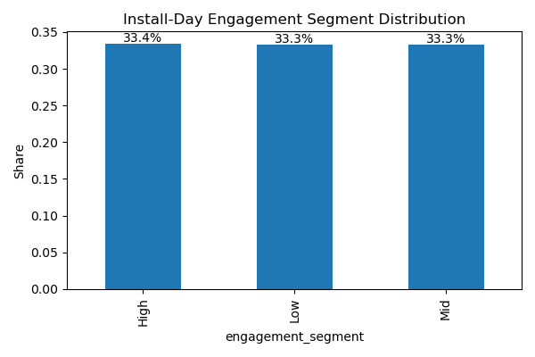

---

## Engagement and Monetization Relationship

### Revenue by Engagement Segment
High early engagement strongly correlates with monetization intensity.

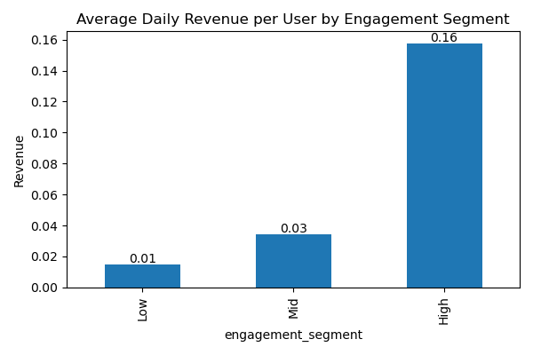

### Revenue Mix by Segment
- Low engagement users skew toward ad revenue
- High engagement users are IAP-dominant
- Mid segment represents a transition cohort

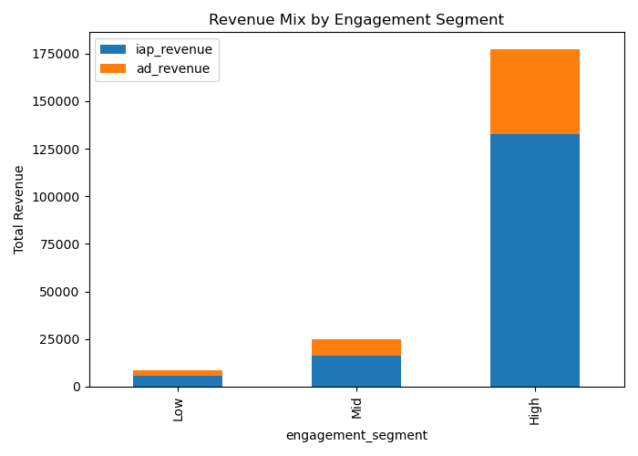

---

## Session Behavior Over User Lifetime

### Session Duration vs User Age (≤ 360 days)
Session duration increases rapidly during early learning, stabilizes mid-lifecycle, and slightly increases for long-term core users.

Mean vs median divergence highlights heavy-tail behavior.

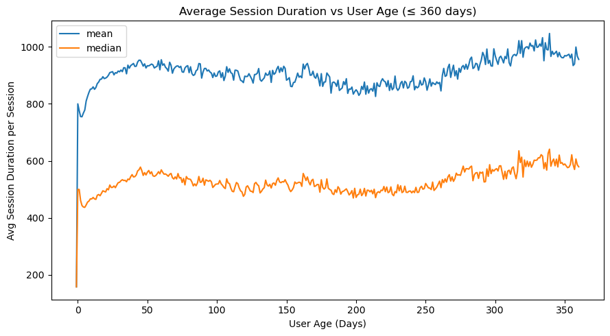

For completeness, the untrimmed lifetime view (used only to illustrate long-tail noise) is also included:

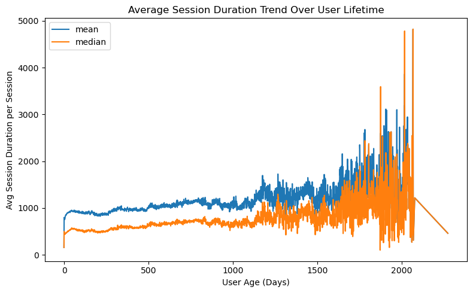

---

## Match Performance Over Time

### Win Rate vs User Age (≤ 360 days)
Early spikes are driven by tutorial and low match counts; rates stabilize as difficulty and skill increase.

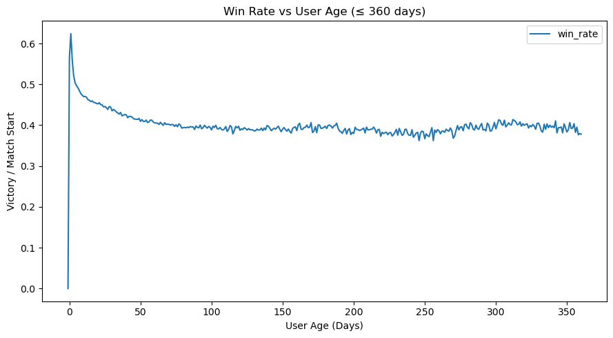

### Match Completion Rate vs User Age (≤ 360 days)
Completion rate shows early stabilization followed by gradual variance as content complexity increases.

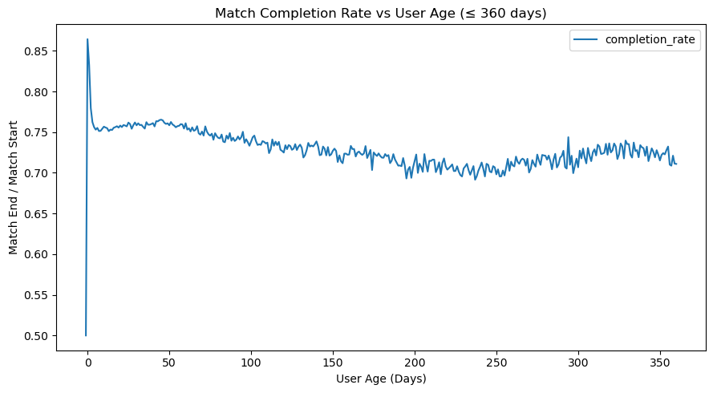

Full-lifetime views are included for transparency but not used for interpretation due to small-sample noise:

- 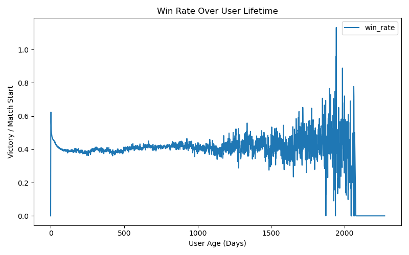
- 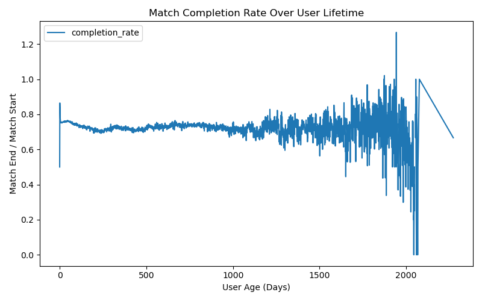

---

## Retention Analysis (7-Day Cohort)

Retention metrics are computed on users whose install dates allow full 7-day observation.

### Retention by Platform
iOS shows consistently stronger retention, especially by Day 7.

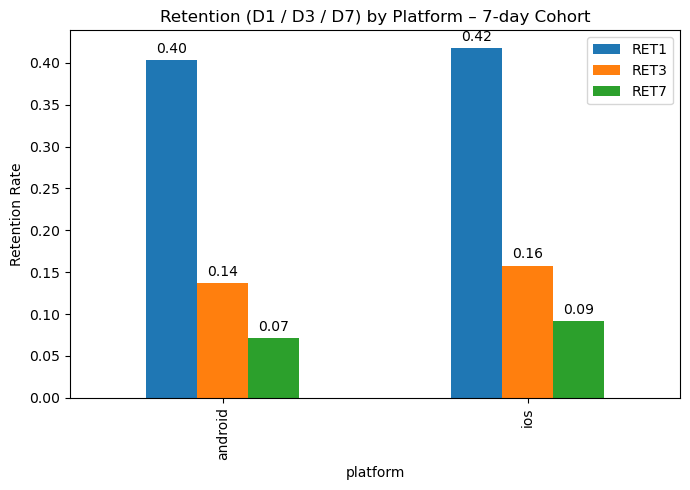

### Retention by Country (Top 50 Countries Filtered)
Countries are ranked by D7 retention among the top 50 countries by cohort size to ensure statistical robustness.

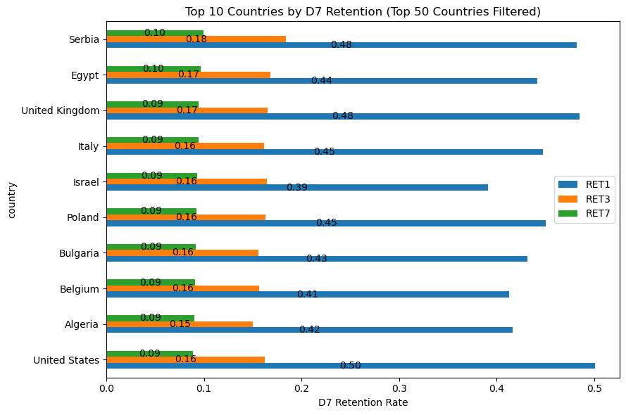

High retention does not necessarily imply high monetization, a distinction explored further below.

---

## Monetization Analysis

### LTV by Platform (7-Day Cohort)
iOS users consistently outperform Android users across LTV1, LTV3, and LTV7.

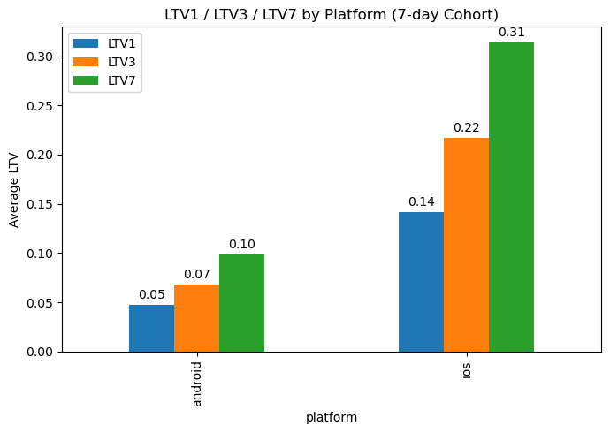

### LTV by Country (Top 50 Countries Filtered)
Countries are ranked by LTV7 to reflect short-term monetization potential.

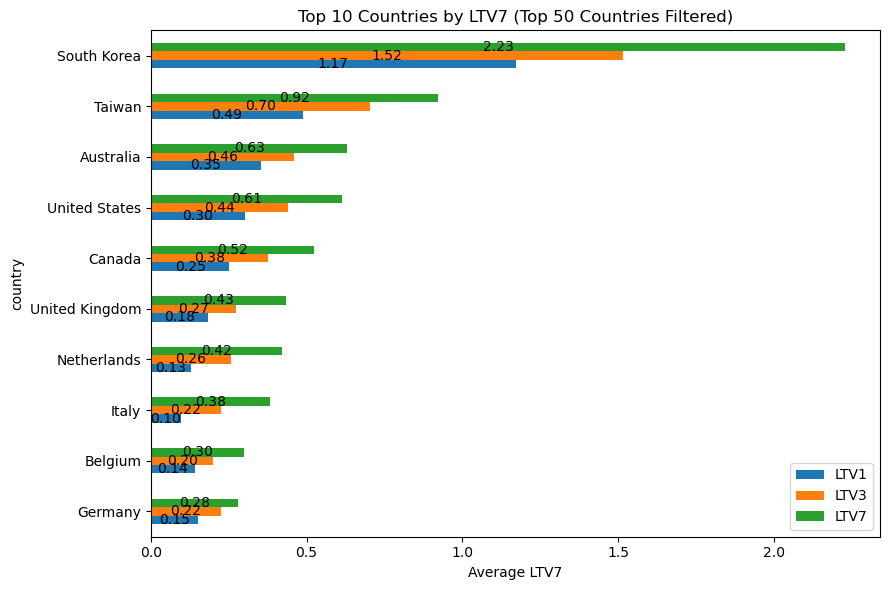

### ARPDAU by Platform
Daily monetization efficiency is significantly higher on iOS.

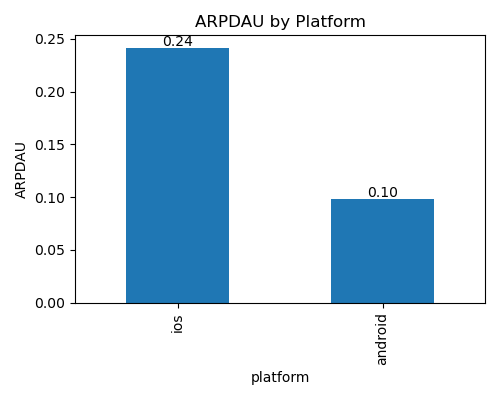

---

## Revenue Composition & Scale

### Total Revenue by Country
Top revenue countries reflect a mix of high ARPU markets and high-volume regions.

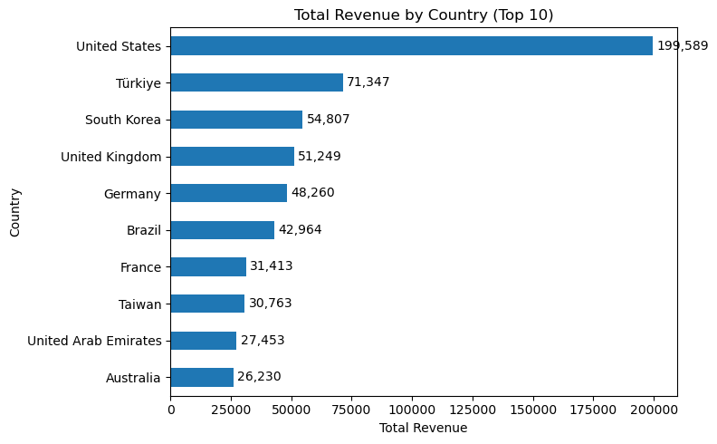

### Platform Revenue Breakdown
Android contributes more ad revenue, while iOS dominates IAP revenue.

- 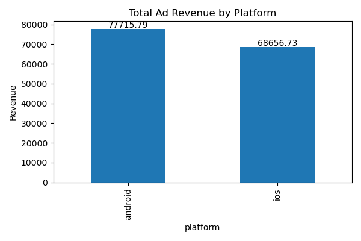
- 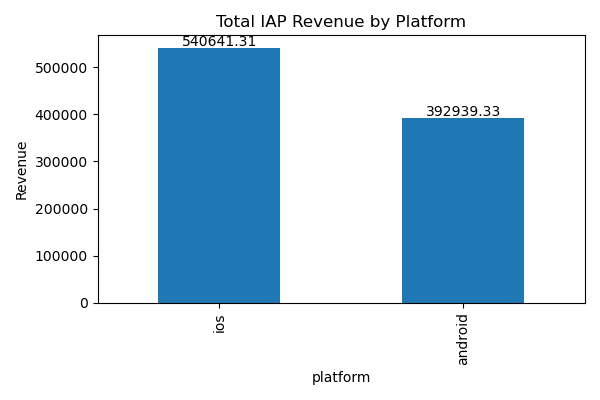
- 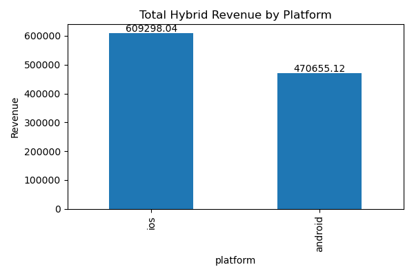

---

## Key Takeaways

- Early engagement is a strong predictor of both retention and monetization.
- Retention and monetization are correlated but not interchangeable; high-retention regions are not always top revenue drivers.
- iOS represents a higher-quality monetization channel, while Android contributes scale and ad-driven revenue.
- Proper cohort definition and lifecycle trimming are essential to avoid misleading long-tail artifacts.

---

## Limitations

- Mean-based monetization metrics are sensitive to heavy-tail behavior; medians were checked for robustness but not emphasized.
- Long-term lifecycle behavior beyond the observation window cannot be inferred.
- Country-level results are intentionally filtered to reduce low-volume noise.

---

## Appendix: Additional Diagnostic Visuals

The following figures are included for completeness and diagnostic purposes.  
They illustrate long-tail behavior across the full observed user lifetime but are **not used for primary conclusions** due to increased noise at higher user ages.

- **Full lifetime session duration trend**  
  

- **Full lifetime win rate trend**  
  

- **Full lifetime match completion rate trend**  
  

These visuals are provided for transparency and to justify lifecycle trimming decisions (e.g., limiting analyses to `user_age ≤ 360`).

---

## My UserID at Vertigo Games:

Critical Strike:  9CC6A43732CC9890
Polygun Arena:  A93530556BE8BED4

---

## Release
Final version tagged as **v1.0**
